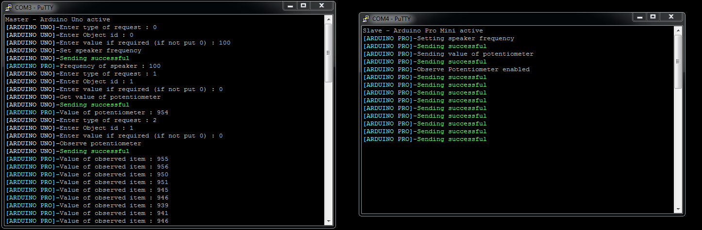

# Arduino-nRF24L01-Radio-Communication-project

* Introduction
* Manual
* Description
* Example of work

## Introduction
---

Hello, I am glad to see you reading this file. Code you are reading now is a simple example how to make radio communication using [nRF24L01+](https://www.sparkfun.com/datasheets/Components/nRF24L01_prelim_prod_spec_1_2.pdf) modules.
Any questions send via mail at : **boocianpawel@gmail.com**

## Manual
---

1. User should open terminal at COM X nad Y where devices are connected. Do it using fx. **Putty**. Download link [here](https://www.putty.org/)
2. Master (Arduino UNO) is waiting for user request.

User puts request ( 3 variables ) using this markings  :

    First variable - TYPE ∈ {0,2} - 0-Set/Put , 1-Get , 2- Observe
    Second Variable - OBJECT ∈ {0,2}  0-Speaker , 1-Potentiometer , 2-Metrics
    Third Variable - VALUE ∈ <0,65534> 

Then it's converted to request_id ->

    request_id = 00 <- SET_SPEAKER_FREQ
    request_id = 10 <- GET_SPEAKER_FREQ
    request_id = 11 <- GET_POTENTIOMETER_VAL
    request_id = 12 <- GET_METRICS
    request_id = 21 <- OBSERVE_POTENTIOMETER 

3.User should get answer from Slave (Arduino Pro Mini ) with required result.

Short manual is also included above the source code.

## Description 
---
# NRF24L01 setup

At the beginning you must include dedicated libraries for Arduino RF `RF24` and `RF24Network`. If you didn't have them yet, download in Atom terminal using command `platformio -g install "name"` . After this we are creating RF24 object called radio with params (7,8). Both figures means number of pin when nRF24L01+ module are attached. Then create RF24Network object using previous radio. Next step is creating device nodes in used radio channel, it is done here `RF24NetworkHeader uno_header(UNO_NODE);` where **UNO_NODE** equals 00.   It's Arduino Uno ID in radio channel used by our modules. We need to identify our devices in network. At the ned we need to set up network using command `network.begin(CHANNEL,UNO_NODE);`.

To send message NRF use network.write() method with 3 variables.Node who is sender,&message and third sizeof message. `network.write(sender,&message,sizeof(message))` 
To receive message we need to check if something is available. Use then **network.available()** If so, NRF use **network.read()** method with 3 variables.Node who is recipient (recipient == UNO_NODE) ,&message and third sizeof message. `network.read(recipient,&message,sizeof(message))`.

# How it works ?  
We have 2 devices `Arduino UNO` as a master and `Arduino Pro Mini` as a slave. Both of them use `Request` and `Response` class. It's our way to handle incoming and outgoing messages. Master device and Slave device use special method to handle radio communication. Firstly when user puts request, 3 variables are converted into one called `request_id`. Using this variable device knows what type of question it should send to slave. Then slave recived a message and parse id to request variable `Id`. Checking by Id, slave do some logical operations then pack required value into response variable `value` and send it to Master. Master knows what type of response recived by `Id`.Then it prints answer from Slave device in terminal window. 

As you can see we have 5 options implemented. First 4 are simple to understand. Only Observe requires explanation. When user puts observe option, slave device in every loop looks if in this case potentiometer value has changed. If so, send it immediately to master.

We have also implemented system showing us if sending has been succeed or not.

## Example of work
---
Here you can see how it really looks. I did test of `Set Frequency, Get Potentiometer Value and Observed item`.
As you can see at the screens below, everything works fine.

Video of all functionality here [BocianooTech](https://www.youtube.com/channel/UClkl_F0n8ZwLmSB5RVzRORw)
